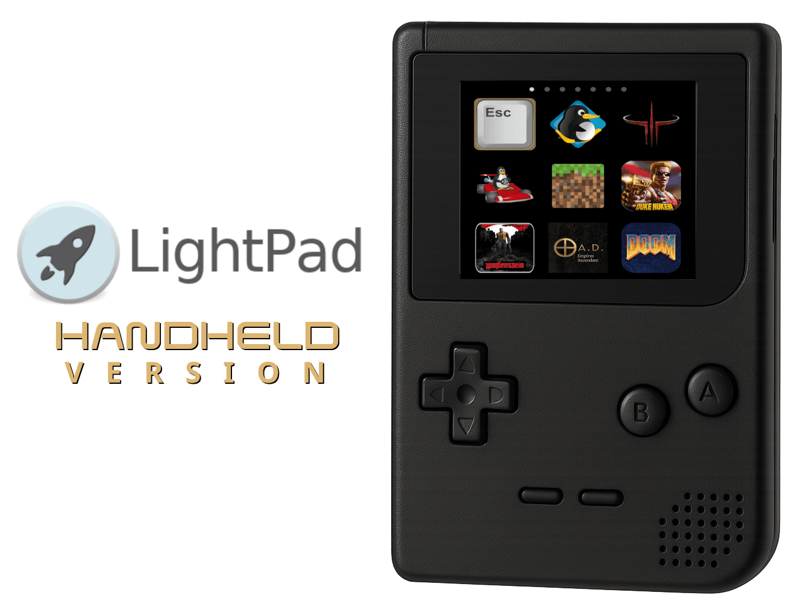

# Handheld Version


LightPad is a lightweight, simple and powerful application launcher. It is also Wayland compatible.

## Compilation

  > **NOTE**: packaging files are now tracked in a separated [packaging](https://github.com/libredeb/lightpad/tree/packaging) branch.

  1. Install dependencies:
  * For Ubuntu:
  ```sh
  sudo apt-get install meson ninja-build libgee-0.8-dev libgnome-menu-3-dev cdbs valac libvala-*-dev libglib2.0-dev libgtk-3-dev libsdl2-dev python3 python3-wheel python3-setuptools gnome-menus
  ```
  * For Fedora:
  ```sh
  sudo dnf install meson ninja-build libgee-devel gnome-menus-devel cdbs vala libvala-devel glib-devel gtk3-devel sdl2-compat-devel python3 python3-wheel python3-setuptools gnome-menus
  ```
  * For Arch Linux:
  ```sh
  sudo pacman -Sy meson ninja libgee gnome-menus vala glib2 gdk-pixbuf2 gtk3 sdl2-compat python python-wheel python-setuptools
  ```
  2. Clone this repository into your machine
  ```sh
  git clone https://github.com/libredeb/lightpad.git
  cd lightpad/
  ```
  3. Create a build folder:
  ```sh
  meson setup build --prefix=/usr
  ```
  4. Compile LightPad:
  ```sh
  cd build
  ninja
  ```
  5. Install LightPad in the system:
  ```sh
  sudo ninja install
  ```
  6. (OPTIONAL) Uninstall LightPad:
  ```sh
  sudo ninja uninstall
  ```

## Blocklist File (optional feature)

Another new added functionality, is the ability to hide applications using a blocklist file. In the file:
> `$HOME/.lightpad/blocklist`

You must add line by line the full name of the binaries of the applications you want to hide in LightPad. For example:
```
nautilus
rhythmbox
gnome-screenshot
gnome-terminal
firefox
htop
/usr/bin/gparted
/usr/bin/vlc
```

These lines appear in the **.desktop** files located in `/usr/share/applications` as the value of the **Exec=** tag.

## Environment Variable: `LIGHTPAD_CATEGORIES`

You can control which application categories are displayed in LightPad by setting the `LIGHTPAD_CATEGORIES` environment variable.  
This variable should contain a comma-separated list of category names. The comparison is case-insensitive and ignores extra spaces.

**Example:**
```sh
export LIGHTPAD_CATEGORIES="Games, System Tools,Internet"
```

If `LIGHTPAD_CATEGORIES` is not set, all available categories will be shown by default.

- Category names must match those defined in your system menu (e.g., "Games", "Internet", "System Tools"). For more information see: [freedesktop.org/menu-spec/categories](https://specifications.freedesktop.org/menu-spec/latest/category-registry.html).
- Unrecognized category names will be silently ignored.

## Icon Cache

To improve startup performance, LightPad now implements a persistent icon cache.

- **Location:**  
  The cache is stored in `$HOME/.lightpad/cache/`.

- **How it works:**  
  On first launch, LightPad loads and scales each application icon, saving a PNG version in the cache directory. On subsequent launches, icons are loaded directly from the cache, significantly reducing startup time.

- **Cache invalidation:**  
  If an application icon changes on the system, the cached version will not update automatically. To refresh the cache, simply delete the contents of `$HOME/.lightpad/cache/` and restart LightPad.

- **Disk usage:**  
  The cache only stores scaled PNG icons for the applications shown in LightPad. Disk usage is minimal, but you can clear the cache at any time if needed.

- **Troubleshooting:**  
  If you experience missing or outdated icons, try clearing the cache directory and relaunching LightPad.


## Tested Devices

The handheld version of LightPad has been tested and works as expected on the following devices:

- **Raspberry Pi Zero 2 W**
- **Raspberry Pi 3 Model B+**

Please note that performance and appearance may vary slightly depending on the device's screen resolution.

## Changelog

**Handheld version release candidate 1:**
* Deleted searchbar
* Deleted dinamic background
* Adapted to squared screens
* 3x3 application grid
* Mapped W, A, S, D keys to move the selected item
* Added support for generic USB Joysticks using SDL2 library
